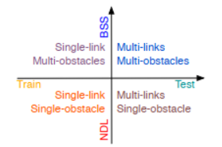

# Toward Ubiquitous Vision-Augmented Intelligent Communications: A Generalized Loosely Coupled Approach

 Ming Xia, Ziyang Lin, Jiaquan Jin, Yu Hen HU, Zhen Cheng and Kaikai Chi.

 <strong><a href='https://www.zjut.edu.cn/'>Zhejiang University of Technology</a>, <a href='https://www.wisc.edu/'>University of Wisconsin-Madison</a> </strong>

  

## README

This is a preliminary release of the dataset for our paper "Toward Ubiquitous Vision-Augmented Intelligent Communications: A Generalized Loosely Coupled Approach". The data for training and testing the **Network Deployment Learning (NDL)** model are in `datasets/NDL`. and the data for training and testing the **Blockage Scene Simulation (BSS)** model are in `datasets/BSS`. Currently, the visual modality data have been preprocessed to probide only the trace of pedestrian obstacles, allowing result reproducing while protecting the pedestrian's privacy. A more comprehensive version, including documentation, code, etc., will be available soon.

<!-- ## Datasets Introduction

### Overview
Aiming at realizing ubiquitous vision-augmented communications in various network deployments, our dataset adopts
different deployment configurations for model training and testing.

Specifically, the dataset is organized into four quadrants as fig shown below.

  

### Data Description
### 1. NDL train
NDL train data refers to the data to train Linear Fitting Reliablity Estimator(LFRE), which c
### 2. NDL test

### 3. BSS train

### 4. BSS test

### Data Volumn
| Data | Volumn | 
|-------|------------------|
| NDL train | 456000 | 
| NDL test | 414000 | 
| BSS train | 132000 | 
| BSS test | 117000 | 

## 👉 TODO
- [ ] Upload the code of NDL and BSS.
- [ ]  -->
